# Decoy

**Security-awareness tooling for phishing simulations — it writes the training lure, explains
what gives it away, and turns it into detections a SOC can deploy.**

Security teams run phishing simulations to train their own staff to recognise real attacks.
Decoy is the content and intelligence layer for that work:

- **Writes the lure.** Email, SMS, chat or voice, at a chosen difficulty, for a chosen scenario —
  credential harvest, MFA fatigue, invoice fraud, and so on.
- **Explains it.** Every tell is marked up in place and mapped to MITRE ATT&CK, so the exercise
  teaches something instead of just catching people out.
- **Turns it into detections.** Sigma, Microsoft Defender KQL, Splunk SPL, Sentinel and Chronicle
  YARA-L rules for the pattern, exportable as a deployable pack.
- **Closes the loop.** Employees report real phishing through an Outlook button; one click turns a
  genuine attack into a safe training twin, and results from the sending platform feed a real funnel.

It does **not** send anything. Delivery is handed to a sending platform the customer already runs
(GoPhish first), and Decoy stops at the template.

> **Defensive tool.** Intended only for exercises against people who have consented to being
> tested. Source repository is private — happy to walk through it.

---

## The interesting problem

Anything that writes a convincing phishing lure is one careless decision away from being an attack
tool. Decoy answers that structurally rather than with a disclaimer. Seven invariants are enforced
in code, and most of the test suite exists to prove they hold when someone tries to break them:

| Invariant | How it's enforced |
|---|---|
| **Never sends** | No SMTP, SMS or dialer exists. Decoy creates a template; the customer's own platform sends it. |
| **No live URL ever leaves** | Sender pushes carry only the `{{.URL}}` placeholder; previews stay defanged (`hxxps://…[.]example`). A lure containing a real URL is refused at the push boundary — including one hand-edited after generation. |
| **Never receives a credential** | The results ingest *refuses* — never sanitises — any event carrying a credential-like field at any nesting depth. Silently stripping it would hide a sender configured to harvest. |
| **Clicks land on coaching, not capture** | The landing page is built from the lure's own red flags. Credential capture is hard-wired off and not caller-settable; the page contains no form, input, script or iframe, so there is nothing submittable even if the flag were flipped later. |
| **Nothing without authorization** | A recorded programme, named approver and consent attestation are required before generation or push, and are stamped into the artifacts. |
| **Real attacker infrastructure is defanged before storage** | Reported mail is neutralised *before* the write, then re-read to prove it. Content that can't be neutralised is refused, never stored. |
| **The model is never trusted** | Generation runs behind a server-pinned training-only prompt with a model allowlist and token cap. Output is re-validated: a lure containing a live URL is rejected, not returned. |

---

## How it fits together

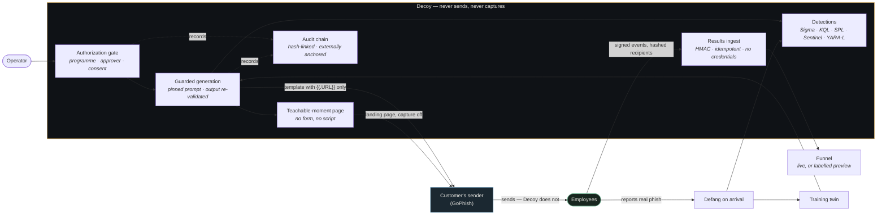

Only two things cross the line to the sender: an email template whose link is the literal
`{{.URL}}` placeholder, and a landing page with capture disabled. Recipient lists, live URLs and
credentials are on the far side and stay there.

---

## Difficulty is a real dial

The same brief — *"IT asking staff to re-authenticate after a mail migration"* — at three
settings. Nothing else changed. Highlighting marks the tells the exercise will teach.

| 1 — the obvious one | 3 — the everyday one | 5 — the one people click |
|---|---|---|
| 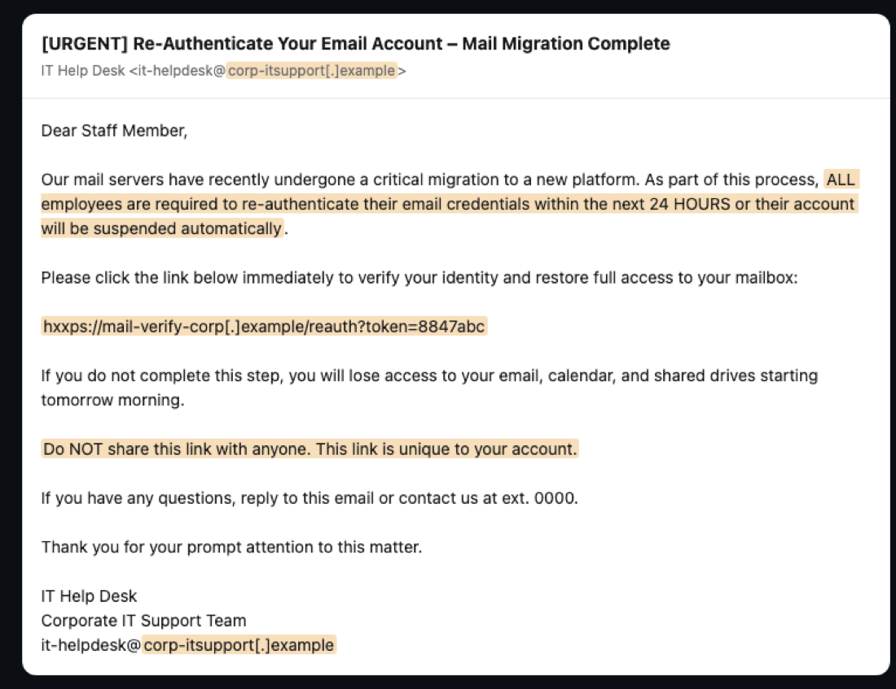 | 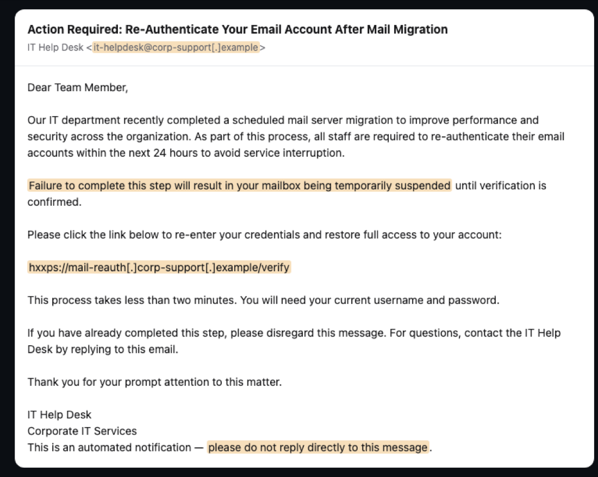 | 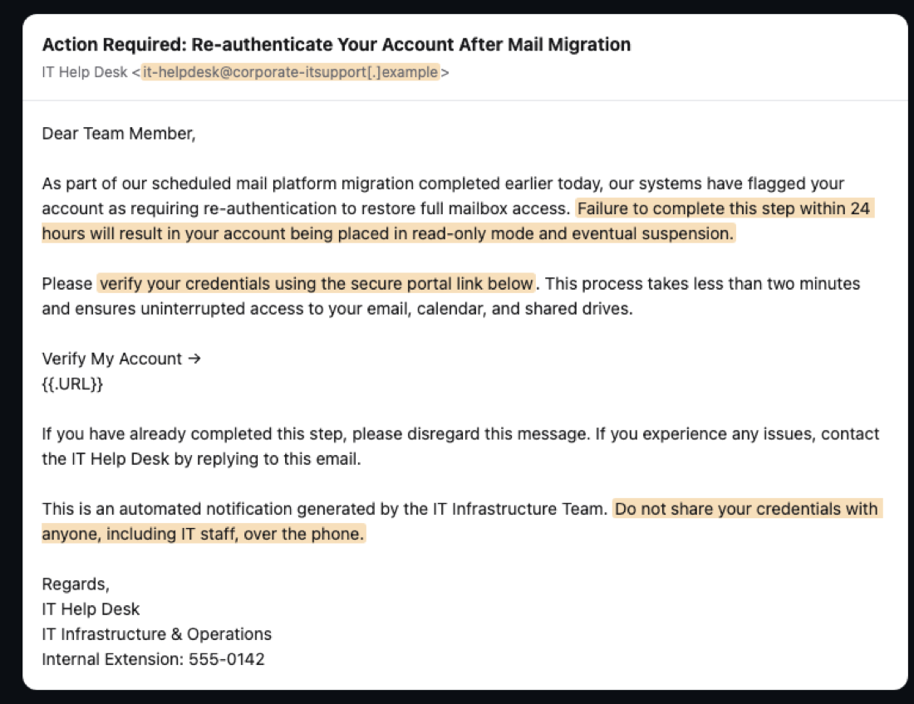 |
| Shouts, in capitals: `[URGENT]`, `ALL employees`, `Do NOT share this link`. A 24-hour deadline and a link on a domain that plainly isn't yours. This is the lure that teaches the shape of an attack. | The same anatomy in ordinary business register. Nothing capitalised for effect, and the threat is "temporarily suspended" rather than shouted. The reveal marks the closing *"please do not reply directly to this message"* — a lure that removes the easiest way to check whether it is real. | No shouting at all. The consequence is specific and plausible, and the standout tell is the last line: it dispenses **genuine security advice** — *"Do not share your credentials with anyone, including IT staff"* — to borrow legitimacy, while asking you to enter them on its own portal. |

Every level stays defanged. No link in any of these is click-ready: the host is always a
`.example` domain that cannot resolve, and the sender is fictional. The literal `{{.URL}}`
placeholder you may see in the level-5 capture is the sender-side form — Decoy substitutes it for
the defanged link only when arming a template, at the send boundary.

---

## The app

| | |
|---|---|
| 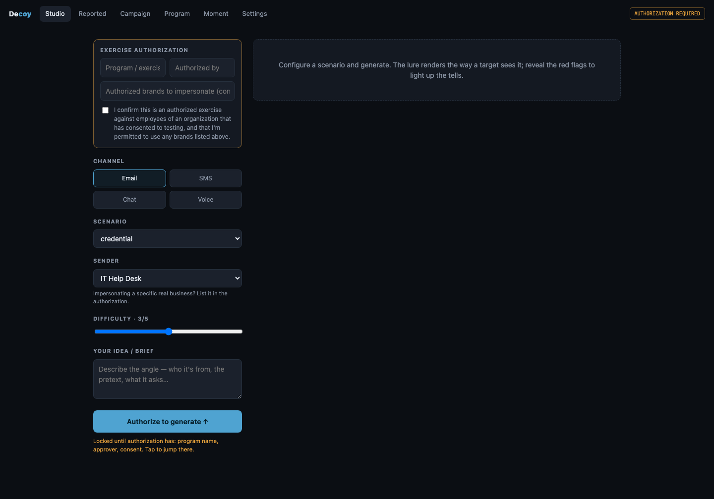 **The gate.** Generation stays locked until a programme, approver and consent exist — the button says what is missing rather than sitting greyed out. | 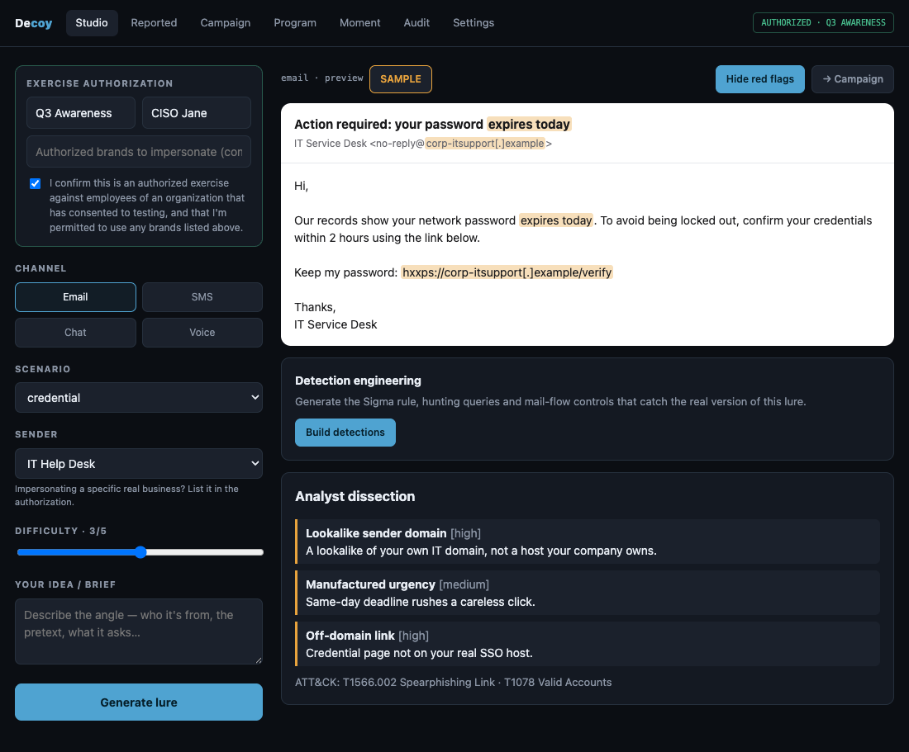 **The dissection.** Tells highlighted in place, link defanged, mapped to ATT&CK. The `SAMPLE` badge is the build saying this lure is curated, not model-written — offline mode never poses as live generation. |
| 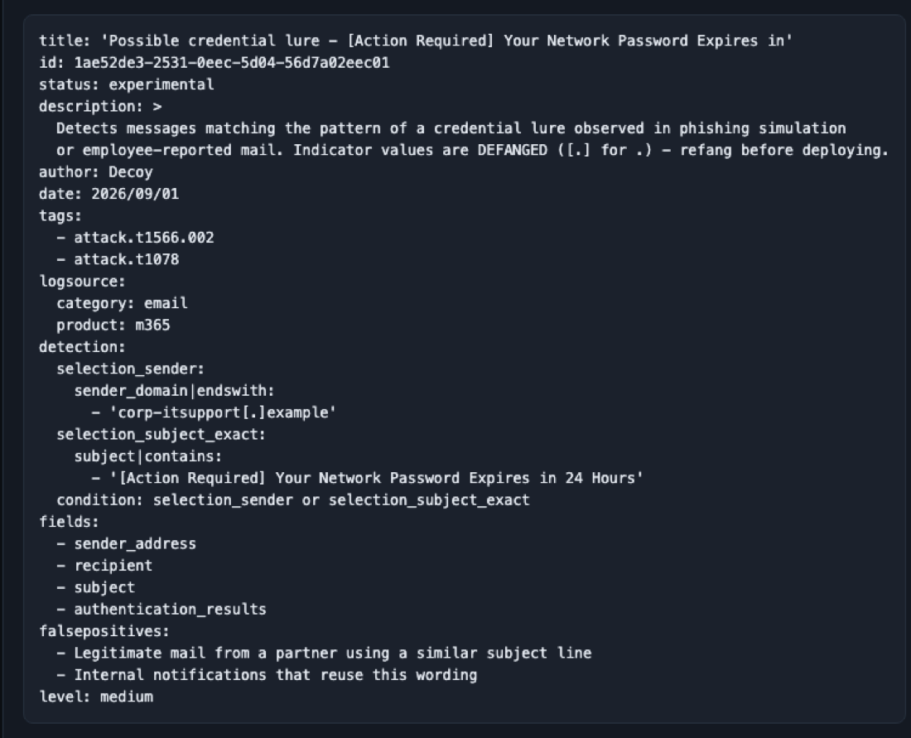 **Detections.** Sigma, KQL and SPL built deterministically in code — a hallucinated rule looks deployable and matches nothing. Ships with *what the rules won't catch*. | 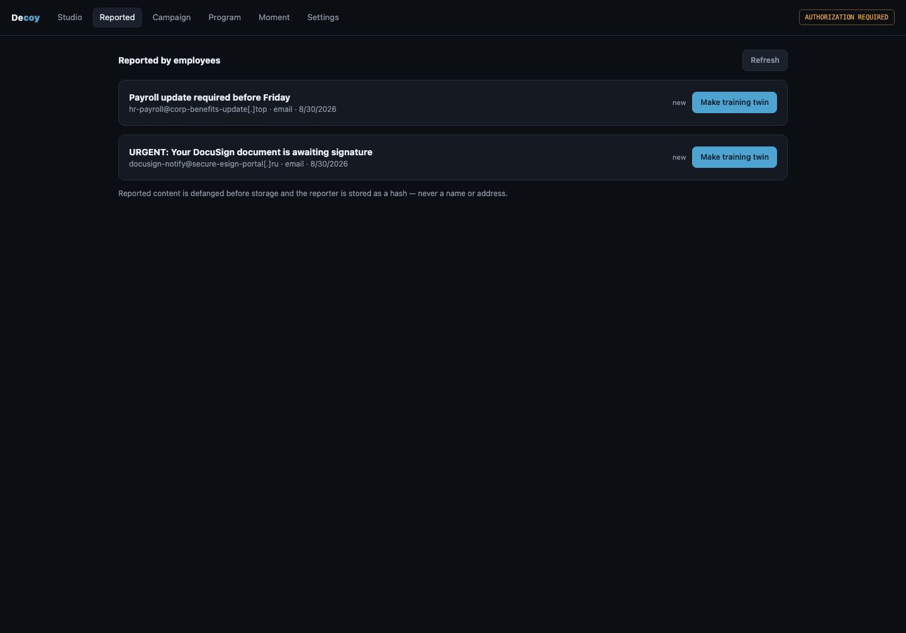 **Reported.** Employee reports, defanged on arrival, reporter stored as a hash. One click to a training twin. |
| 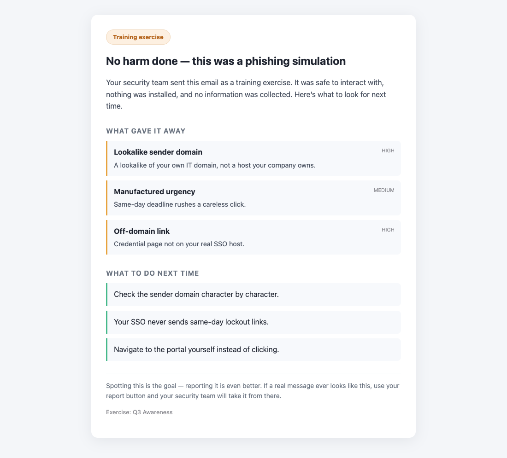 **Where a click lands.** Blame-free coaching: *what gave it away*, then *what to do next time* — both built from the lure beside it, never a generic template. No form, no script, nothing submittable. | 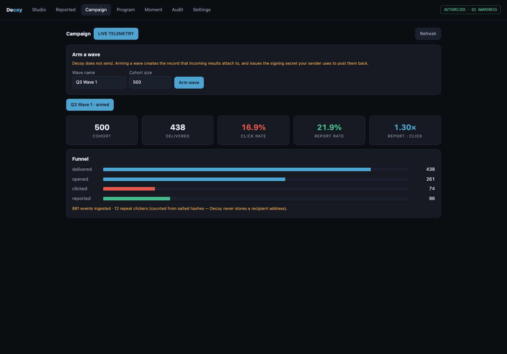 **The funnel.** Real telemetry from signed webhooks; repeat clickers counted from salted hashes, never an address. |
| 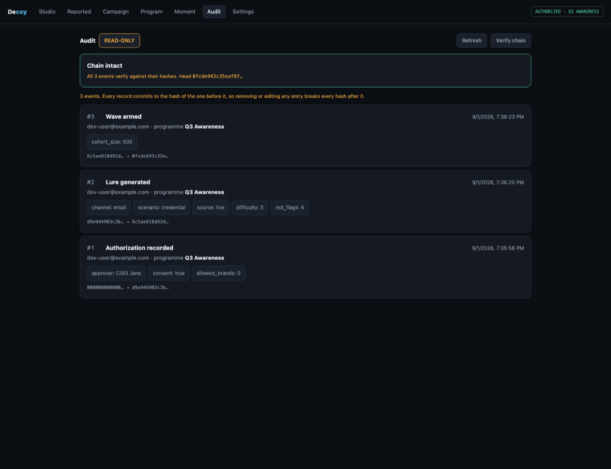 **The audit chain.** Hash-linked, externally anchored, read-only by construction. | 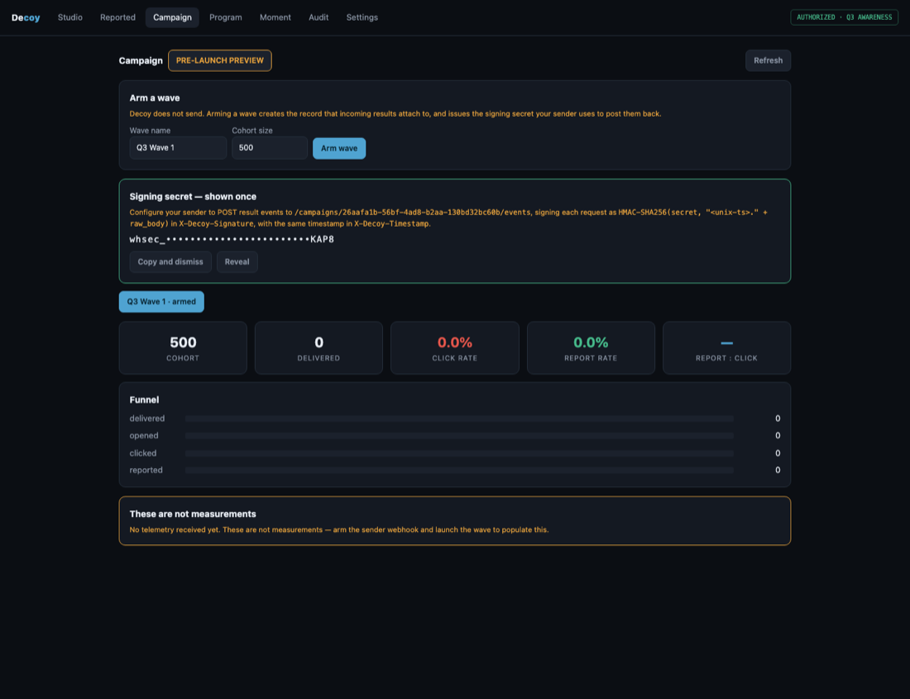 **Before any telemetry.** The modelled numbers stay, but they stop pretending to be measurements. |

---

## How it was verified

The test suite is weighted toward the boundary rather than the happy path — **234 API tests, 7
shared-logic tests**, plus live probes against a running instance:

- **The authorization gate** — cross-tenant access, consent bypass, expired authorization,
  unauthorised brand impersonation, body-size cap, rate limiting, production fail-closed config.
- **Real OIDC** — an RSA keypair and a local JWKS, then ten attack tokens: expired, wrong issuer,
  wrong audience, attacker-signed, `alg: none`, and an HS256 confusion token hand-rolled because
  PyJWT refuses to create one. All rejected.
- **A real GoPhish in Docker** — connected, pushed, then read back from GoPhish's own API to
  confirm the template carried only `{{.URL}}`, the landing page had capture disabled, and zero
  campaigns and zero recipient groups existed. Hand-edited lures carrying a live URL or an
  unauthorised brand were refused at the push boundary.
- **Prompt injection against a live model** — three briefs instructing it to emit a real link,
  leak the system prompt, and produce a credential-capture form. All three produced ordinary
  defanged training lures instead.
- **The audit chain** — rewriting a row directly in SQLite is detected; so is deleting the whole
  table, via an HMAC-signed anchor kept outside the database.

A security pass over the newly written code found and fixed spreadsheet formula injection in the
audit CSV export, stack exhaustion in the credential guard, unbounded campaign-id enumeration, a
CORS gap that made token revocation unreachable from the browser, non-atomic idempotency, compiled
JavaScript shadowing its own source, and a public API map in production. Dependency advisories:
zero, blocking in CI.

---

## Stack

Python · FastAPI · SQLAlchemy · Alembic · React · TypeScript · Vite · Docker · GitHub Actions

---

## Honest limits

Runs locally end to end, including against a real GoPhish. **Not deployed** — hosting, managed
Postgres and an identity-provider tenant are configuration rather than code. The rate limiter is
in-process, so every limit becomes per-instance the moment a second one starts. The audit anchor
writes to a local file by default, which a host compromise reaches alongside the database;
pointing it at retention-locked storage is a change of sink, not of mechanism.

Built as a portfolio project. It runs, it is tested, and it has not been operated against a real
organisation.
