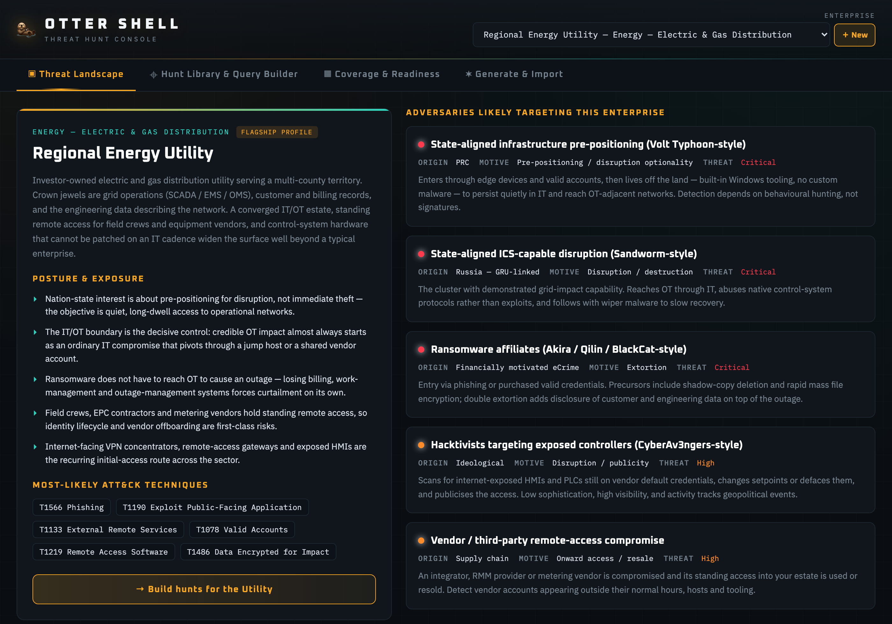
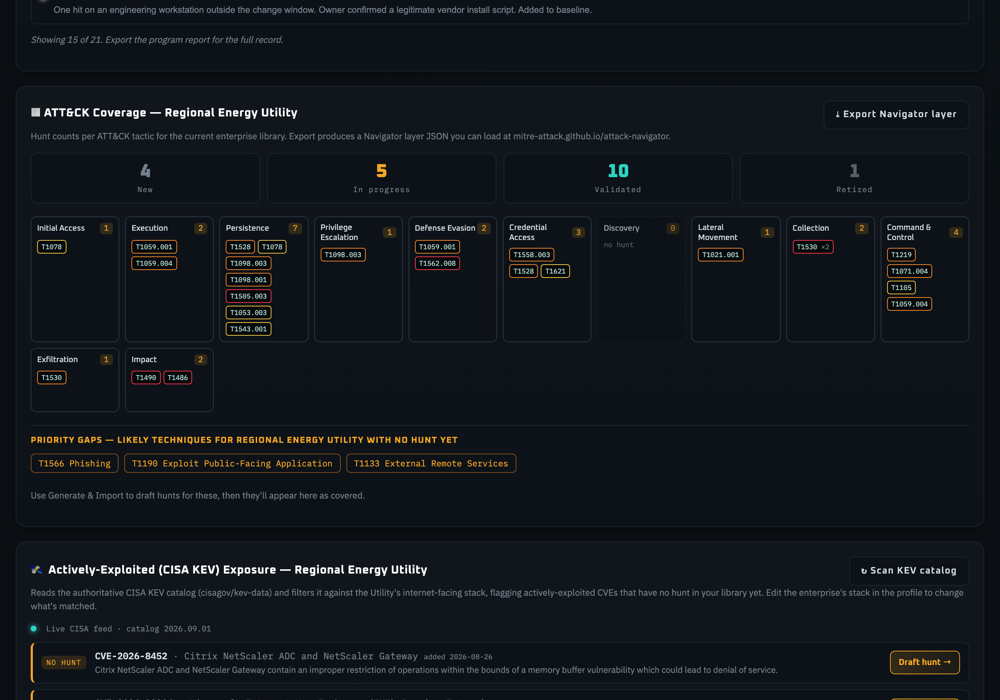
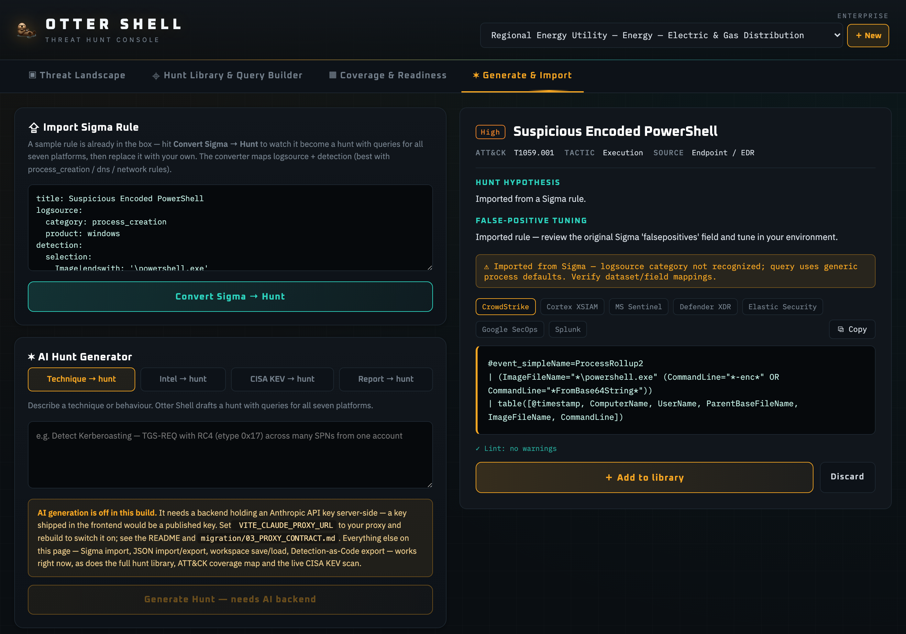

# Otter Shell

**A threat-hunt authoring and tracking console — it drafts the hunt query for seven SIEM/EDR
platforms at once, then tracks that hunt through a lifecycle until someone has actually run it.**

Threat hunting produces a lot of queries and very little institutional memory. The query gets
written in a Slack thread, run once, and lost; six months later nobody can say whether the
technique was ever covered, or what the thresholds were tuned to, or what came back. Otter Shell
is the authoring and record layer for that work:

- **Writes the query, everywhere.** One hunt renders as CrowdStrike LogScale, Cortex XSIAM XQL,
  Sentinel KQL, Defender XDR advanced hunting, Elastic ES|QL, Google SecOps YARA-L and Splunk SPL.
- **Starts from the threat, not the query.** An enterprise profile carries the sector's likely
  adversaries and ATT&CK techniques, so hunts are picked against a threat model rather than vibes.
- **Tracks the hunt, not just the query.** Status, version, tuning log, and a dated findings
  journal — a clean result is recorded as coverage, not as nothing.
- **Says how far a query has been trusted.** Four validation levels, from *unverified* through
  *syntax*, *ran against real telemetry*, to *fired on an Atomic Red Team test*.
- **Closes the loop on what's actually exploited.** Scans the live CISA KEV catalog against the
  org's internet-facing stack and flags actively-exploited CVEs with no hunt yet.
- **Round-trips Sigma.** Imports a Sigma rule into all seven platforms, exports the library as a
  detection-as-code pack.

It does **not** connect to a SIEM and it cannot run a query. Every query it produces is a
validated-syntax **starting point** to confirm and tune against real log sources.

> **Test / portfolio project.** Not production security tooling, not supported, and not validated
> against a live SIEM. The defensive framing is the point: it authors and records hunts, and never
> touches live telemetry.
>
> **Source:** [github.com/LittleJeter/otter-shell](https://github.com/LittleJeter/otter-shell) —
> including the [security audit](https://github.com/LittleJeter/otter-shell/blob/main/docs/security-audit.md)
> and the [feature audit](https://github.com/LittleJeter/otter-shell/blob/main/docs/feature-audit.md),
> which record what was found, what was fixed, and what is knowingly left open.

---

## The interesting problem

A tool that writes detection queries has an honesty problem. A generated query *looks* deployable —
correct syntax, plausible field names — and it will happily return zero rows forever because the
field is called something else in your deployment. A confident wrong answer is worse than no
answer, because it buys a false sense of coverage.

Otter Shell is built so the tool cannot overstate itself:

| Claim it could make | What it does instead |
|---|---|
| "Here is your detection" | Every query is labelled a **validated-syntax starting point**, with a standing note that field, dataset and index names vary by deployment. The disclaimer is a feature, not boilerplate. |
| "This hunt is validated" | Validation is a **four-level ladder the user sets** — unverified → syntax → ran → Atomic — with a free-text note recording *where* it was validated. The tool never marks its own work as validated. |
| "Your coverage is 18 hunts" | The ATT&CK map counts hunts per tactic *and* names the likely techniques with **no hunt at all**, so coverage is stated alongside its gaps. |
| "These are the exploited CVEs" | The KEV scan reads the **authoritative CISA catalog** at runtime and shows the catalog version, rather than asking a model to recall CVEs. |
| "The query is fine" | A conservative linter checks bracket balance, placeholders and time windows. It is deliberately quiet: a test asserts it raises **zero** warnings across all 126 curated queries, so an amber warning always means something. Warnings and notes are separate severities and are labelled as such — the time-window nudge is a **Note**, fires on 47 of the 126, and is expected, because most consoles take the lookback from the search bar rather than the query. A "quiet" linter that still prints something amber on a third of its own library is not quiet. |
| "AI generates the hunts" | The generator is **off unless an operator configures a backend** holding an API key server-side. The 18-hunt library, Sigma round-trip, coverage map and KEV scan are all deterministic and work with no model at all. |

---

## Start from the threat, not the query

An enterprise profile carries the sector's posture, its likely ATT&CK techniques and the adversary
groups that plausibly target it, so hunts are picked against a threat model rather than vibes.
Every profile is an illustrative sector composite and names no real organisation; the adversary
cards describe public tradecraft clusters, hence the *-style* suffixes.

---

## The record, not just the query

The part that makes it a hunt programme rather than a query generator. One screen carries all of
it: the platform picker, the hunt's lifecycle and validation state, the rendered query, the lint
result, and the journal.

- **How far this has been trusted.** The validation ladder — *unverified → syntax → ran → Atomic* —
  is set by the user, with a free-text note recording where. This hunt is at the top rung: *Atomic*,
  "Detected a real Atomic Red Team execution of the technique — true-positive proven — Atomic Red
  Team T1059.001-1 (2026-08-26)." That is the user's claim, dated and sourced, not the tool's. The
  row above it tracks *created*, *last reviewed* and *last run* separately, so a hunt that was
  validated once and never looked at since cannot hide behind the badge.
- **What the linter actually said.** `✓ Lint: no warnings for CrowdStrike`. Warnings and notes are
  different severities, rendered differently and counted separately: the zero-warnings claim in the
  table above is about warnings, and the time-window nudge that fires on 47 of the 126 curated
  queries is a note.
- **The standing disclaimer.** Every query, every platform: *validated-syntax **starting point**.
  Field, dataset and index names vary by deployment.*
- **The journal.** Next steps and pivots for when it fires ("pull the parent process tree, then the
  same user's auth events ±4h and any new outbound destinations"), a tuning log for the thresholds
  someone landed on and why ("raised to 3+ encoded invocations/hour per host … excluded SVC-SCCM and
  host BLD-07"), and dated findings — including the clean ones, which are the evidence that a
  technique was actually looked for. The hunt card in the middle rail carries that result forward:
  *Last run 2026-08-26 · Clean*.

The rail reads *20 hunts matched* against the 18-hunt curated library quoted elsewhere on this
page: 18 built-in plus the two user-authored hunts the demo workspace ships with. The linter's
126-query claim covers the 18 curated ones, which are the ones the build tests.

---

## Coverage with its gaps

Hunts per tactic — and, directly underneath, **the likely techniques for this enterprise with no
hunt at all**. Discovery is empty here and says so rather than being omitted. Each technique gets
one chip with a count (`T1530 ×2`), so two hunts covering one technique read as depth rather than
as two techniques covered.

Above the map, the same panel counts the library by lifecycle state — 4 new, 5 in progress, 10
validated, 1 retired — so "20 hunts" never reads as twenty finished hunts.

---

## What is actually being exploited, this week

Directly below the coverage map, on the same screen. It reads the **authoritative CISA KEV catalog**
at runtime — rather than asking a model to recall which CVEs are exploited — filters it to the
enterprise's internet-facing stack, and flags the ones with **no hunt in the library yet**. One click
drafts that hunt.

- **The provenance is on screen.** *Live CISA feed · catalog 2026.09.01*: the reader can tell which
  catalog version produced these rows, and whether the feed was reachable at all. Before a scan the
  panel says *"No scan yet"* rather than rendering an empty table, which would read as a clean bill.
- **The descriptions are CISA's**, verbatim, and the `RANSOMWARE` markers are CISA's own
  known-ransomware-campaign flag rather than something inferred here.
- **`NO HUNT` is the finding.** The panel exists to name the distance between what is being exploited
  in the wild and what this library covers — NetScaler, IKE, vCenter, ASA/FTD, FortiOS, Ivanti
  Sentry, PAN-OS, Exchange and EPMM, for this profile's stack.

These rows are whatever CISA had published on the day of capture, so this screenshot is not
reproducible row for row. That is what a live feed looks like.

---

## Sigma in, seven platforms out

One imported rule, rendered for CrowdStrike LogScale, Cortex XSIAM XQL, Sentinel KQL, Defender XDR,
Elastic ES|QL, Google SecOps YARA-L and Splunk SPL — the seven tabs above the query. The converter
says what it could not resolve (*"logsource category not recognized; query uses generic process
defaults — verify dataset/field mappings"*) instead of producing something that merely looks right.

Below it, the honesty about the model: **AI generation is off in this build**, because it needs a
backend holding the API key server-side and a key shipped in the frontend is a published key. The
Sigma converter leads the column because it is the part that works. Everything on this page except
the generator — Sigma import, JSON import/export, workspace save/load, detection-as-code export —
is deterministic, as are the hunt library, the coverage map and the KEV scan.

---

## How it was verified

**50 tests** over the pure logic, plus browser-level verification of the things a unit test cannot
see. The suite is weighted toward the claims that would embarrass the tool if they were wrong:

- **The linter must stay quiet.** It asserts **zero** warnings across all 126 curated queries
  (18 hunts × 7 platforms). A linter false positive, or a malformed query, fails the build — because
  an amber warning is only useful if it is rare. A second test pins the time-window nudge at
  *note* severity, so it cannot quietly get promoted into the warning count it would then break.
- **The coverage map must not double-count.** A technique covered by two hunts renders as one
  chip with a count, not as two techniques — asserted, after it read as a duplicate on screen.
- **Every hunt carries every platform.** No hunt can ship missing a query, an empty query, an
  invalid severity or an unknown data source.
- **Sigma round-trip.** A rule imports, renders for all seven platforms, and exports back with its
  title and ATT&CK technique intact.
- **Hostile input.** The ingestion paths — JSON import, workspace file — are tested with 500 KB
  strings, unknown platform keys, out-of-enum values, 5,000-entry arrays, and `__proto__` keys that
  survive `JSON.parse`. One test is a regression for a real defect: a workspace file carrying only
  `{id, name}` used to pass validation and then blank the page.
- **Content-Security-Policy, in a real browser.** Driven over the DevTools protocol against the
  production build: the app mounts, the CISA feed origin is reachable, an unauthorised origin is
  refused, blob-URL exports still work, and the console is clean.
- **Responsive layout, measured rather than eyeballed.** The document was **682 px wide inside a
  390 px viewport** before the fix and 390 px after, with zero overflowing elements at 360, 390 and
  768 px across all four tabs.
- **Accessibility, asserted in the DOM.** A real tablist with arrow-key navigation, a radiogroup for
  the platform picker, and **zero** buttons without an accessible name.

---

## Built with

React 18 and Vite 8, no UI framework — the interface is hand-rolled CSS. Vitest for the suite.
A strict CSP (`default-src 'none'`, `script-src 'self'`, no inline script) is generated from a
single source of truth that feeds both the build-time meta tag and the deploy headers, so the two
cannot drift. The only host the app contacts unprompted is the CISA KEV feed.

**About these screenshots.** Captures of the built app, not mockups. The enterprise profile,
the hunt library, the findings and the tuning notes are the shipped demo content — an illustrative
sector composite naming no real organisation — so the dated runs and dispositions are authored
demo data, not a record of hunts anyone ran. The CISA KEV catalog and its version are read live
from cisa.gov at runtime.
