# PatchGuard Pro

**A desktop vulnerability scanner written for people who don't know what a CVE is — it inventories
the software actually installed on a machine, checks each app against NIST NVD and CISA's
actively-exploited catalog, explains the risk in plain English, and patches it in one click.**

Vulnerability scanners are built for security teams. They assume you know that CVSS 9.8 is worse
than 7.2, that "actively exploited" means drop everything, and that a CPE range is a thing. The
people running six-month-old Chrome installs are not those people. PatchGuard is the same pipeline
aimed at a consumer:

- **Reads the machine, not a questionnaire.** Windows registry across three hive paths, macOS
  `/Applications` plus Homebrew casks, Linux dpkg — no manual entry. Written, compiled and
  unit-tested; not yet exercised against a real install.
- **Checks against live sources.** NIST NVD for CVEs and CVSS, and the CISA Known Exploited
  Vulnerabilities catalog for what attackers are using *right now*.
- **Filters down to what actually applies.** Each CVE's CPE version ranges are compared against the
  installed version, and its CPE product against the app, so a patched Chrome stops being reported
  vulnerable to CVEs from 2009. The version half of that holds up; the product half is currently
  too loose, and [the write-up says where and why](#the-filter-above-is-not-tight-enough-and-these-two-screenshots-prove-it).
- **Explains it in plain English.** An optional Claude-backed write-up turns a CVSS vector into
  "update this today, and here is what to avoid until you do" — routed through a proxy so no API
  key ships in the binary.
- **Fixes it** — in principle. One-click `winget` / Homebrew updates, with the administrator case
  handled honestly rather than reported as a failure. Implemented and compiled; never run against
  a real package manager (see the note below).
- **Teaches.** A glossary for every term the app puts on screen, and a Stay Safe guide covering the
  scams that actually reach consumers — ClickFix, tech-support calls, fake optimisers.

It does **not** scan the OS itself, Microsoft Store apps, or browser extensions, and it cannot
patch an app it has no package mapping for — it says so on the row rather than showing a dead end.

> **Test / concept project.** Not production security tooling, not supported, and not something to
> point at a machine you care about. It is a prototype built around one question: *can a tool like
> this be trusted by someone who has no way to check its work?*
>
> **What has actually been exercised, and what hasn't.** The scanning, matching, filtering and
> interface logic is real and runs end to end — the screenshots below are live NIST NVD responses
> and the real CISA catalog flowing through the actual code. The parts that touch the operating
> system are **implemented and compile, but have never run in a packaged desktop build**: the
> Windows registry inventory, real `winget` / Homebrew invocation, the elevation flow, the tray
> icon and OS notifications. Until recently the Tauri app could not build at all — three schema
> and import defects sat in `main` — so none of that has ever executed. Patch results in the
> screenshots come from the development mock rather than a real package manager, and the Windows
> and Linux code paths have only ever been compiled by CI, not run.
>
> **Source:** the repository is private — happy to walk through it.

---

## The interesting problem

A consumer security tool has no expert user to catch its mistakes. That makes both failure
directions expensive, and they are not symmetric: crying wolf gets the tool muted, and a missed
exposure is worse than having no tool at all — because the user believed they were covered.

The rule the whole UI is held to is that **an absence of data is never rendered as an assurance.**
Most of the engineering below is that rule applied to a specific place the tool could have quietly
lied:

| Claim it could make | What it does instead |
|---|---|
| "You're secure" — on a machine where nothing has been scanned | The risk dial reads **NOT SCANNED** with em-dashes, and the dashboard says it cannot tell you whether you are safe, "only that it doesn't know." |
| "0 vulnerabilities are actively exploited" — when CISA's catalog failed to load | The KEV counter shows **–**, the header badge goes amber **KEV unavailable**, and the status rail reads **DEGRADED**. Zero is a finding; unknown is not. |
| "This app is safe" — when NVD rate-limited the lookup | A throttled lookup **stores no result at all**. A missing scan is honest; a stored empty one renders identically to "clean". |
| "Chrome has 20 vulnerabilities" — from a keyword search | CVEs whose CPE ranges provably exclude the installed version are dropped and counted in a footer; ones NVD gave no version data for are kept and labelled **VER?**. Confirmed, unknown and excluded are three different states. |
| "You're on the latest version" | Update checks carry an explicit `configured` flag. A build with no release repository compiled in says **no release channel in this build** rather than reporting itself current. |
| "AI remediation: secure proxy" | The status row reflects *this build*. With no proxy token compiled in it reads **Not configured**, and AI is disabled rather than falling back to a token that would be public in the repo. |

---

## Same scan, two states

Both dashboards below are the same 10 apps and the same 17 findings from the same NVD data. The
only difference is whether CISA's catalog could be reached.

| Feeds healthy | CISA KEV unreachable |
|---|---|
| 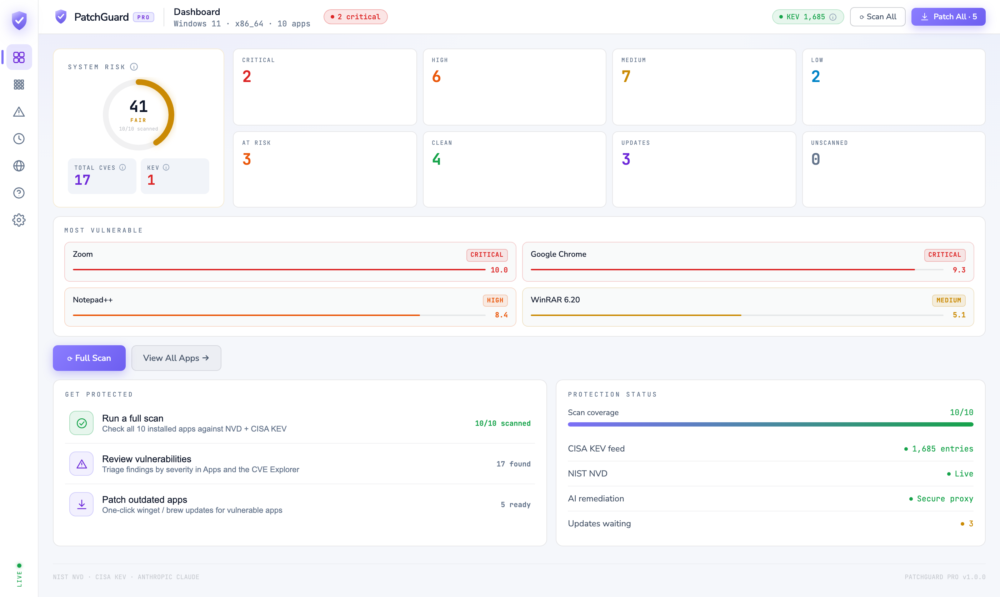 | 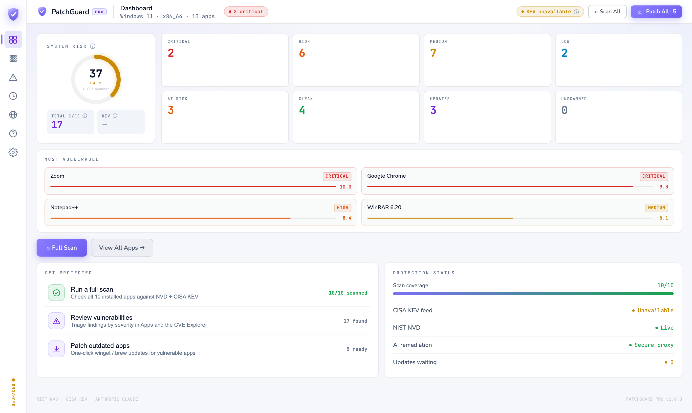 |
| KEV **1,685** entries loaded, one of this machine's findings is on it. | KEV reads **–**, not 0. NVD is still green, because NVD still answered — the degradation is reported per-signal, not as one global "something's wrong". |

The severity tiles are identical across the pair — 2 critical, 6 high, 7 medium, 2 low, 17 total —
because the NVD findings are the same findings. The risk dial is not: **41** on the left, **37** on
the right. KEV exposure is an input to the score, so when the catalog cannot be reached the score
loses that term. That is the honest behaviour and the wrong presentation: a *lower* number on the
degraded run reads as an improvement, when what actually happened is that the tool knows less.
Reporting the score as unavailable — the same treatment the KEV counter gets — is the fix, and it
is not implemented.

This is the bug that produced the rule. The KEV catalog was originally fetched from the webview,
and `cisa.gov` serves that feed **without an `Access-Control-Allow-Origin` header** — so a Tauri
webview, which enforces CORS exactly like a browser, was blocked every time. The `catch` returned
an empty set, every app compared clean against an empty catalog, and the dashboard showed a
reassuring green zero. Nothing errored.

The fix was two changes, because moving the fetch into Rust (where `reqwest` is not subject to
CORS) was not enough on its own — the failure *mode* had to change too. `fetchKEV()` now returns
`{ set, ok }`, and the UI renders the amber state above when `ok` is false.

**The bug was never the CORS block. It was the `catch` that turned an infrastructure failure into
a security assurance.**

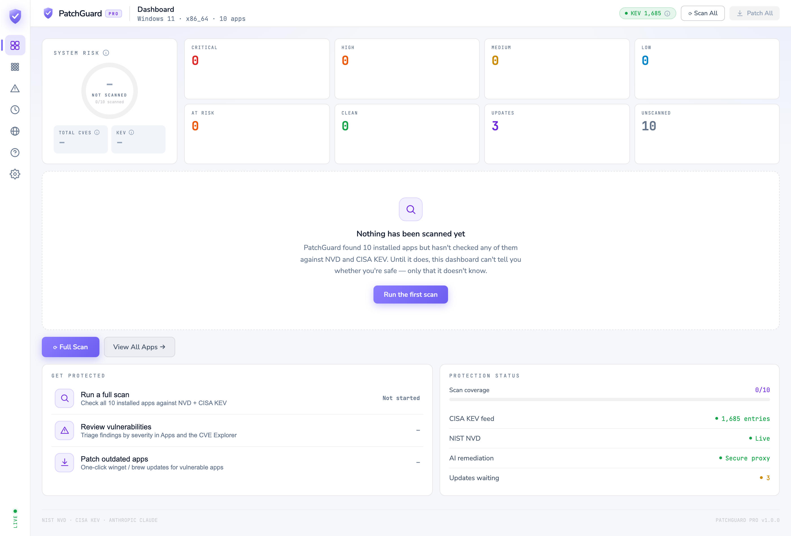

The same rule on first run. This dial used to read **SECURE · 0** in green before anything had been
looked at.

The rule is applied to the dial and to the two counters that carry a verdict — **TOTAL CVES** and
**KEV** both read `—` — but not yet to the eight tiles across the top, which render coloured zeros
for CRITICAL, HIGH, MEDIUM, LOW, AT RISK and CLEAN before anything has been checked. **UNSCANNED
10** sits beside them and the panel below states plainly that nothing has been scanned, so the
screen is not lying overall; a green **CLEAN 0** on an unscanned machine is still the same
un-earned zero the dial was fixed for, and those tiles should render `—` too. Not fixed.

*(**Updates waiting · 3** is genuinely knowable here: update availability comes from comparing
installed versions against the package manager, which is a different question from whether any
CVE applies, and it does not depend on the scan.)*

---

## Calibrated confidence

A naive keyword search reports a fully-patched app as vulnerable to a decade of fixed CVEs. Two
filters run before anything reaches the user, and a third state exists for when neither can answer.

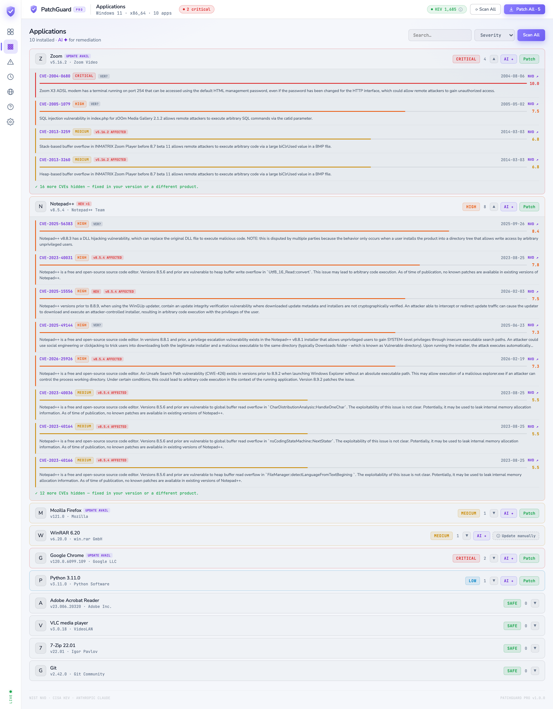

Notepad++ 8.5.4 here shows six findings tagged **v8.5.4 AFFECTED**, two tagged **VER?**, and a
footer reading *"12 more CVEs hidden — fixed in your version or a different product."* Nothing is
silently dropped: the excluded ones are counted, and the ones NVD could not resolve are kept and
marked uncertain rather than cleared.

WinRAR, further down, carries a finding but no **Patch** button, because there is no package
mapping for it — so it shows **Update manually** with an explanation instead of an empty space.

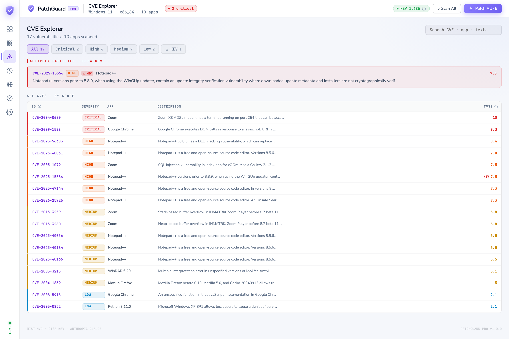

The CVE Explorer pins actively-exploited findings above everything else regardless of CVSS,
because "being used in attacks today" outranks a higher score that isn't.

### The filter above is not tight enough, and these two screenshots prove it

Read the Zoom rows again. `CVE-2004-0680` is a **Zoom X3 ADSL modem**. `CVE-2005-1079` is
**zOOm Media Gallery**, a PHP component. `CVE-2013-3259` and `-3260` are **INMATRIX Zoom Player** —
and those two are not merely listed, they are tagged **v5.16.2 AFFECTED**, which asserts that the
installed Zoom client is vulnerable to a bug in an unrelated media player. Further down: a McAfee
CVE under WinRAR, and a Windows XP SP1 CVE under Python.

The cause is in the filter itself, not upstream of it. An app maps to a set of CPE tokens, and a
`cpeMatch` is accepted when the app's tokens are a **subset** of that match's combined vendor +
product tokens. Zoom's token is `zoom`, so `zoom_x3_adsl_modem`, `zoom_media_gallery` and
`zoom_player` all contain it and all pass. The filter removes CVEs that merely *mention* a product
name in their text — a real and useful thing, and the 16- and 12-CVE exclusion footers are it
working — but it does not distinguish products that share a vendor-or-product token. Tightening it
means matching the CPE **product** field as a whole and qualifying it with the vendor, rather than
testing token containment across both fields at once.

This is stated here rather than cropped out, because the alternative is a write-up whose
centrepiece claim is contradicted by the two screenshots printed directly above it. It is the most
consequential open defect in the project: for a consumer with no way to check the tool's work, a
confidently mis-attributed **AFFECTED** verdict is exactly the failure the whole design is
supposed to prevent.

---

## Explaining and fixing

| | |
|---|---|
| 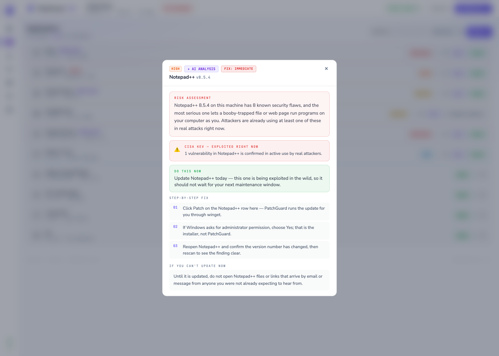 **Plain English, on request.** No CVSS vectors, no jargon — what can happen, what to do now, and what to avoid until it's done. The Anthropic key never enters the binary: requests go through a Cloudflare Worker that pins the model, caps tokens and messages, refuses `system`/`tools`/`stream` overrides, applies its own system prompt server-side, and rate-limits per IP. | 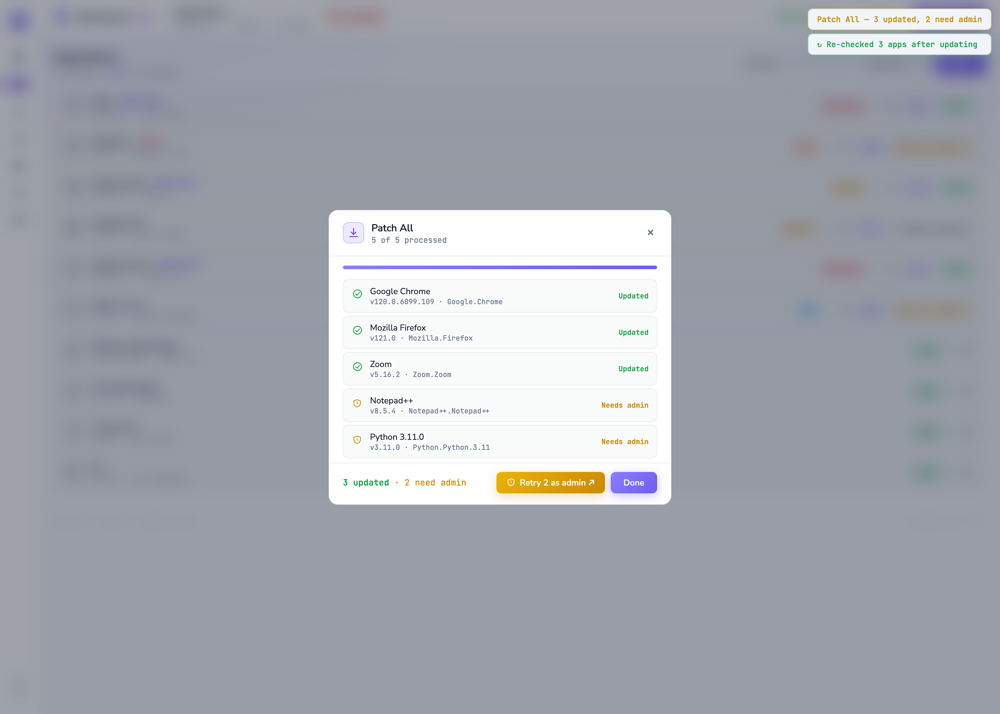 **Elevation, handled honestly.** Updating Chrome needs no admin rights; updating Notepad++ or Python does. The app runs unelevated, detects a permission-blocked update, and offers **Retry as admin** — one expected UAC prompt — instead of reporting a misleading "no update found". A declined prompt is reported as declined. *The statuses shown here come from the development mock, not from a real winget run.* |

---

## Remembering what it found

| | |
|---|---|
| 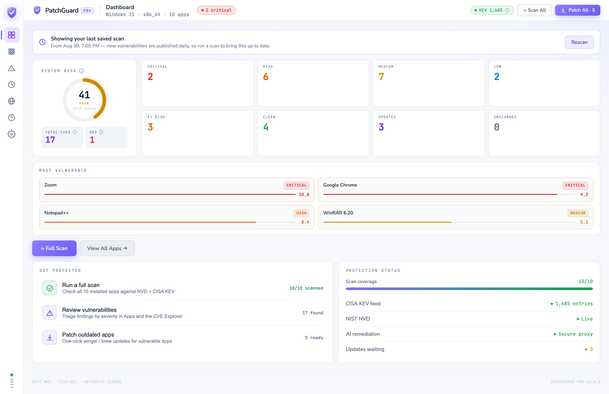 **Restored, and labelled as restored.** Every scan is written to disk. Reopening the app restores it — and says so, with the date, because new vulnerabilities are published daily and a day-old verdict is not a current one. | 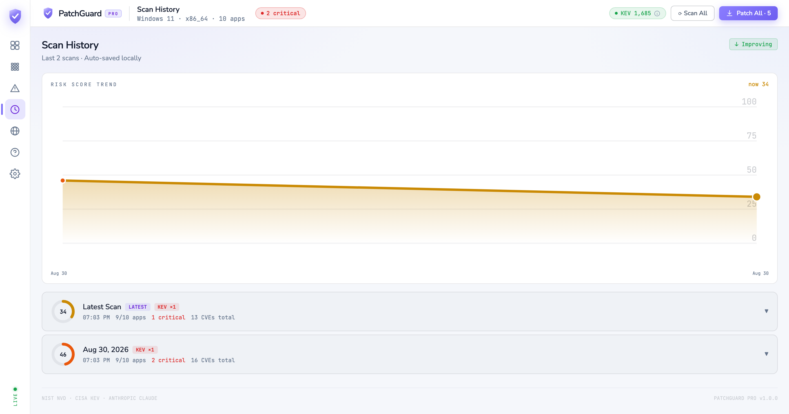 **One row per scan run.** Risk over time, and the runs behind it. The two rows here are a full scan and the automatic re-check that follows patching — 46 → 34, 16 CVEs → 13 — so the tool verifies its own fix rather than showing stale state. *Captured in a different session from the dashboards above, which is why it reads 9/10 apps and 16 CVEs against their 10/10 and 17.* |

---

## The rest of it

| | |
|---|---|
| 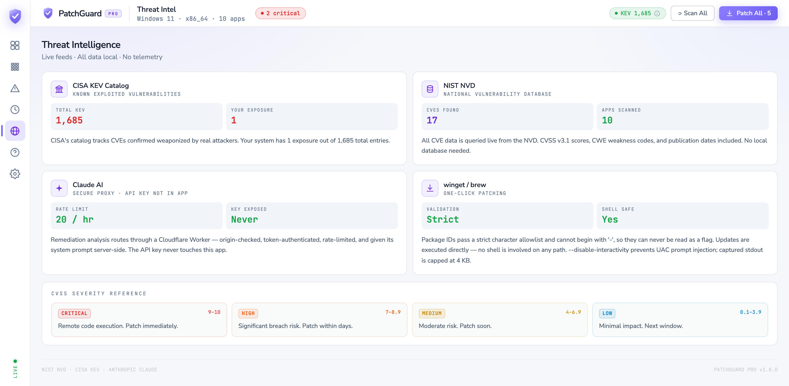 **Where every number comes from** — including the ones a given build cannot back up. | 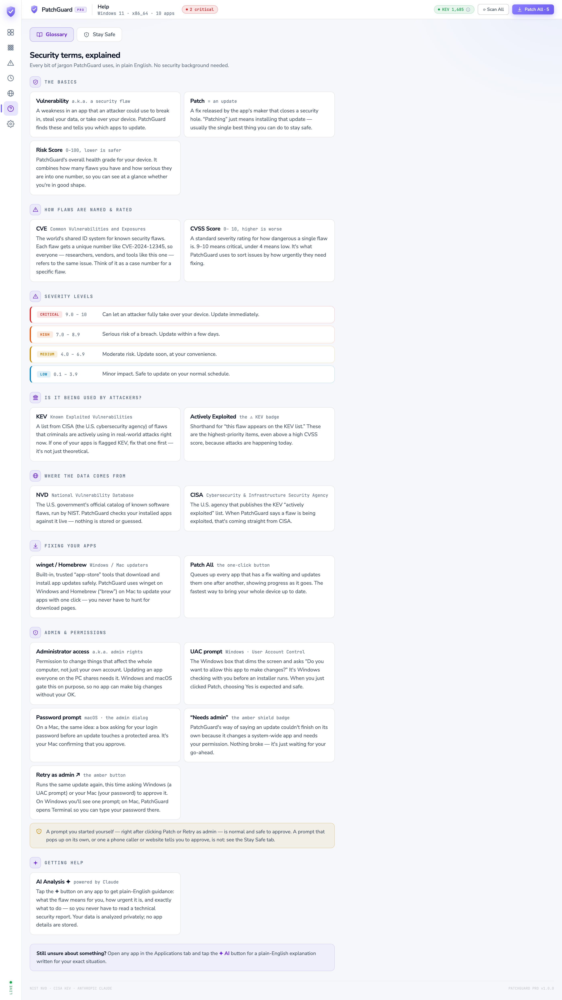 **A glossary for every term on screen,** with inline ⓘ tooltips at each term's first appearance. |
| 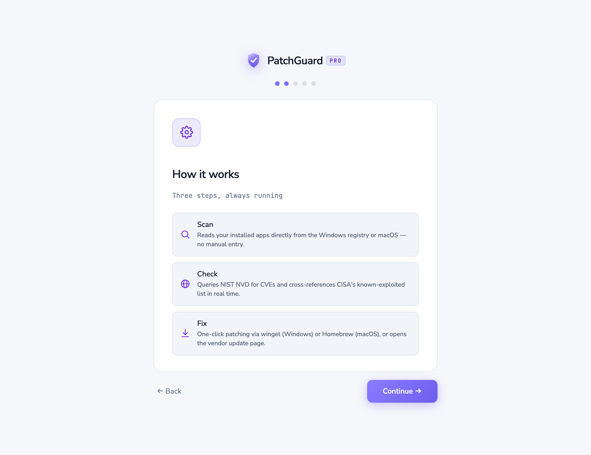 **Five-step setup,** and the first scan starts when the user finishes it rather than while they are still reading. | 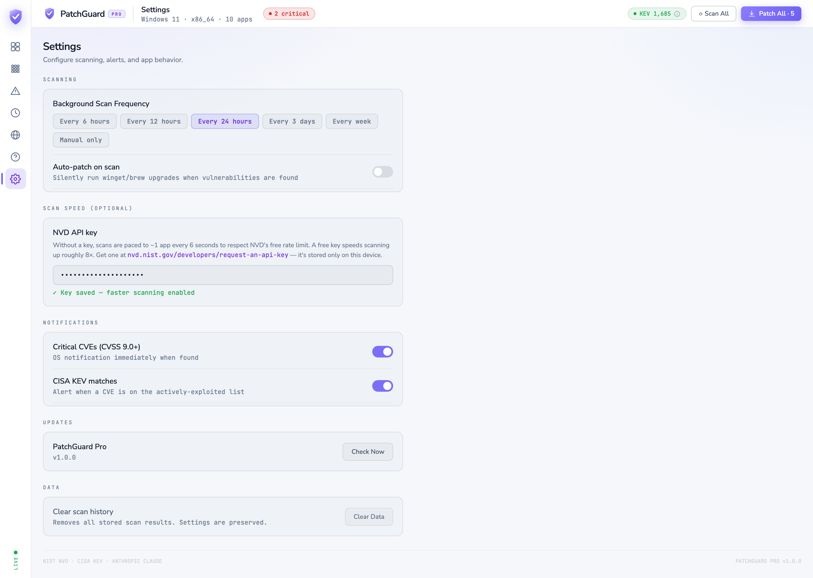 **Only switches wired to real behaviour.** An email-digest and a launch-at-login toggle were removed rather than disabled — a security product offering a switch it never honours is worse than one that doesn't offer it. |

---

## Security engineering

The app shells out to package managers and opens URLs supplied by an external feed, so both paths
are treated as hostile input.

**No shell on any execution path.** `open_url` originally opened a CVE's reference page with
`cmd /C start "" <url>` on Windows. Rust passes arguments to `CreateProcess` as data, which is
safe — but `cmd.exe` then re-parses its own command line, and Rust only quotes an argument
containing whitespace. `&` doesn't trigger quoting, and `&` is both perfectly legal in a URL query
string and a command separator to cmd:

```
https://example.com/a?x=1&calc   →   cmd runs:   start "" https://example.com/a?x=1
                                                 calc
```

Those URLs come from NVD reference data. The fix removes the interpreter rather than trying to
escape for it: `rundll32 url.dll,FileProtocolHandler` takes the URL as a single `CreateProcess`
argument with no shell anywhere in the chain. `validate_url()` was tightened alongside it to the
RFC 3986 character set and to reject userinfo, since `https://www.microsoft.com@evil.example/`
shows one host and opens another.

*"The arguments are passed safely" is a claim about one layer. It stops being true the moment a
second parser gets to read the same string again.*

**Package identifiers.** A strict character allowlist runs before both the normal and the elevated
code path, and an identifier may not begin with `-` — otherwise a crafted name reaches winget or
brew as a *flag* rather than a package, which is the argument-level equivalent of shell injection.
A unit test asserts that every entry in the built-in package map passes its own validator, so a bad
table entry can never become a vector.

**The client holds no secrets.** No API key, and no fallback token — a build without one disables
AI rather than shipping a credential that is public in the repository. Credentials are only ever
sent to an HTTPS origin. The webview runs under a CSP with no `'unsafe-inline'` in `script-src`
(the build emits zero inline scripts), `object-src 'none'`, and an explicit connect-src allowlist.

**Data it doesn't collect.** Hostname and username were being read and the hostname rendered in the
title bar, where "Alex-MacBook-Pro" identifies the owner in every screenshot and support ticket.
Neither was used for anything; both were removed. Fonts are self-hosted, so the app makes no
third-party request at startup and the "no telemetry" claim is true offline.

---

## How it was verified

**26 frontend tests and 24 Rust tests**, weighted toward the claims that would matter if they were
wrong rather than toward coverage percentage.

- **The matching logic is tested by failure direction,** because the two directions have different
  costs: *false positives* (patched app still reported vulnerable, wrong product matched, `git`
  matching `gitlab`) and *false negatives* (in-range CVE missed, nested CPE nodes skipped, a CVE
  cleared because NVD omitted version data).
- **The suite is mutation-tested.** Inverting the exclusive-bound comparison, switching product
  matching from whole-token to substring, and clearing unbounded CVEs each cause failures — 2, 1
  and 2 tests respectively — so the tests are known to be load-bearing.
- **The validators are tested with attacks,** not examples: shell metacharacters, path traversal,
  flag-shaped package identifiers, URL header injection, non-ASCII hosts, and userinfo.
- **Backward compatibility is a test.** A `settings.json` written before two fields were removed
  must still load and keep the values that remain.
- **The UI was driven in a real browser** over the DevTools protocol — onboarding through all seven
  tabs, a full scan against live NVD and the real CISA catalog, the AI modal, and the patch queue —
  asserting zero uncaught exceptions and a clean console. Every screenshot on this page came out of
  that harness.

**What is not verified**, stated plainly because a security tool that overstates its own testing is
the exact failure this project is about:

- **No end-to-end run of the packaged desktop app.** The Rust backend compiles, links and passes its
  unit tests, but the assembled Tauri application has not been launched and pointed at a real
  machine. Registry inventory, real `winget` / Homebrew invocation, the UAC and Terminal elevation
  flows, the tray icon and OS notifications are unexercised at runtime.
- **Only the host target is compiled locally.** The `cfg(windows)` and `cfg(linux)` branches are
  checked by CI, not by running them.
- **The AI write-up shown is representative,** generated in the schema the app requests, rather than
  a captured response from the live proxy.

**Open defects, listed rather than cropped out** — each one visible in a screenshot above:

- **The CPE product filter matches on token containment,** so `zoom` also matches
  `zoom_player` and `zoom_x3_adsl_modem`. Two of those mis-attributed CVEs are tagged **AFFECTED**,
  not merely listed. Diagnosed above; not fixed.
- **The first-run severity tiles render coloured zeros** where the rule says they should render
  `—`. The dial and the CVE/KEV counters do it correctly; the tiles do not.
- **The risk score drops when the KEV catalog is unreachable** (41 → 37) instead of reporting
  itself unavailable, so losing a feed reads as an improvement.
- **The KEV description in the CVE Explorer is truncated mid-word** — a text-overflow bug, not a
  data one.

The mutation-tested matching suite above covers the *version* logic, which is why the defect that
survived is in the *product* logic. That is worth saying: the tests were weighted toward the
failure direction I had already thought about.

---

## Built with

Tauri 2 with a Rust backend and React 19 on Vite — no UI framework, the interface is hand-rolled.
Vitest for the frontend suite, `cargo test` for the Rust. The AI proxy is a Cloudflare Worker whose
defaults are the safe ones, so a bare `wrangler deploy` cannot ship the permissive configuration.
Windows and macOS.

<sub>**About these screenshots.** They are captures of the real interface running against real
data, not mockups — but they are taken in a browser harness where the Tauri bridge is mocked, not
from a packaged desktop build. What is genuine: every CVE, CVSS score, description and version
verdict comes from a live NIST NVD query, and KEV status is matched against the real CISA catalog
for the date shown (1,685 entries). What is not: the installed-app list is the built-in demo set
rather than a real machine, the patch results come from the development mock rather than winget,
and the AI write-up is a representative response in the schema the app requests.</sub>
